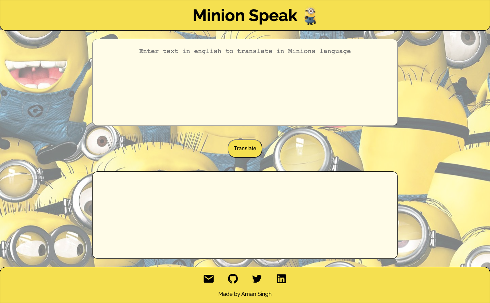

# Minion Speak WebApp
If you are a Minion fan you will surely love this. It is a traslator WebApp which translate english language to minion's language. Built in VanillaJS, HTML & CSS.

---
## Technologies used
- HTML
- CSS
- JavaScript

---
## Preview

---

## Contact

- [Portfolio](https://amansingh.netlify.app "Aman's Portfolio")
- <a href="mailto: reachout.amansingh@gmail.com">Mail</a>
- [Twitter](https://twitter.com/aman11s "Aman's Twitter")
- [LinkedIn](https://linkedin.com/in/aman11s "Aman's LinkedIn")

---
### Live Project Link: [Click Here](https://speak-minion-lang.netlify.app "Minion Translator")

---

### If you like this repository please give a ⭐ in the top right corner. 😊

